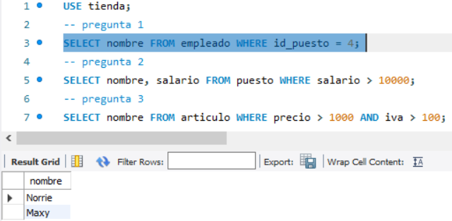
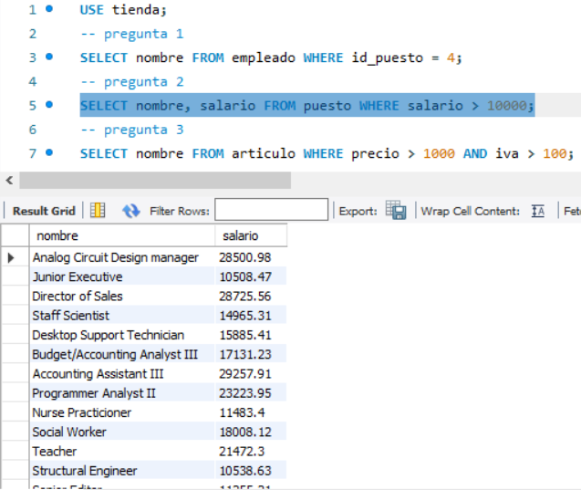
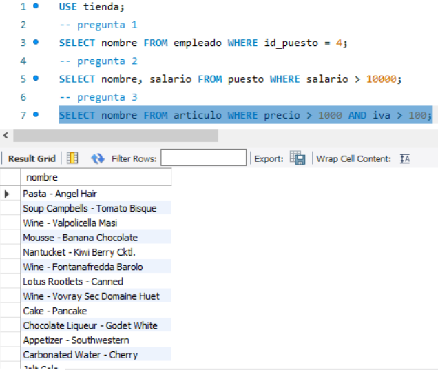
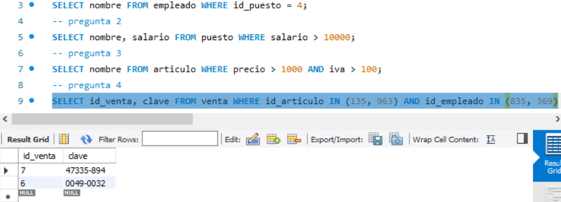

## Reto 2: Solución:
- pregunta 1: Empleado con puesto 4;

- pregunta2: puestos con salario mayor a $10,000;

- pregunta 3: artículos con precio mayor a $1,000 e iva mayor a $100;

- pregunta 4: ventas que incluyen los artículo 135 o 963 y fueron hechas por los empleados 835 o 369;

