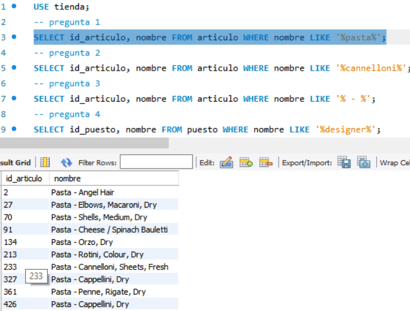
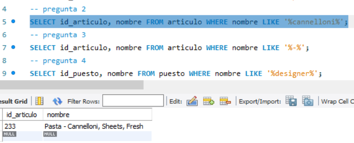
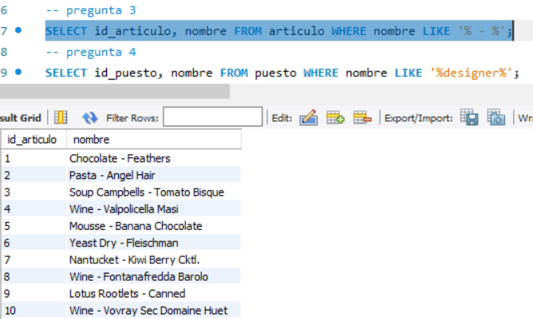
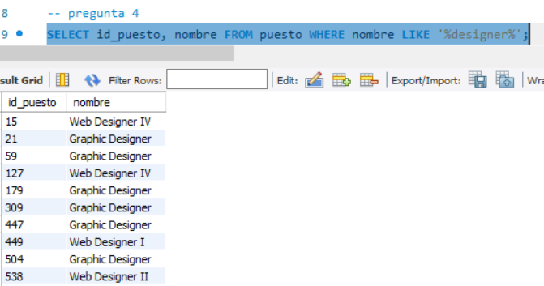
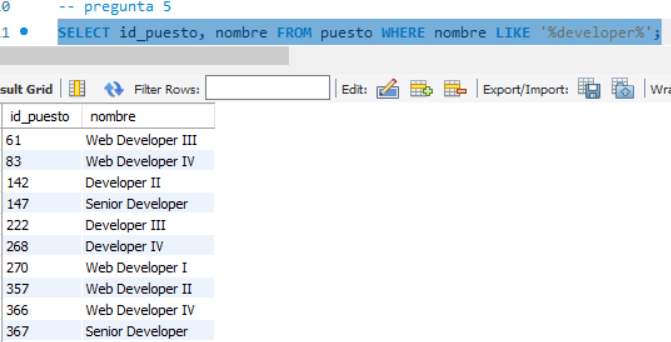

## Reto 1: Solución
- 1.-¿Qué artículos incluyen la palabra Pasta en su nombre? 

- 2.-¿Qué artículos incluyen la palabra Cannelloni en su nombre?

- 3.-¿Qué nombres están separados por un guión (-) por ejemplo Puree - Kiwi?

- 4.- ¿Qué puestos incluyen la palabra Designer?

- 5.- ¿Qué puestos incluyen la palabra Developer?

