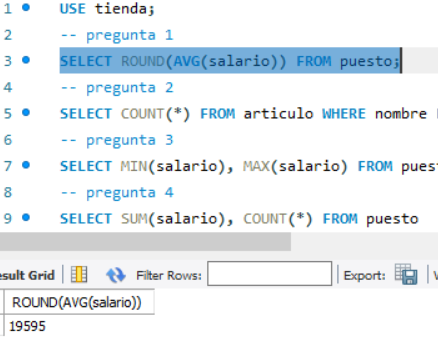
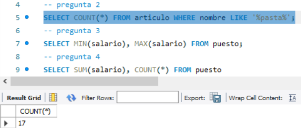
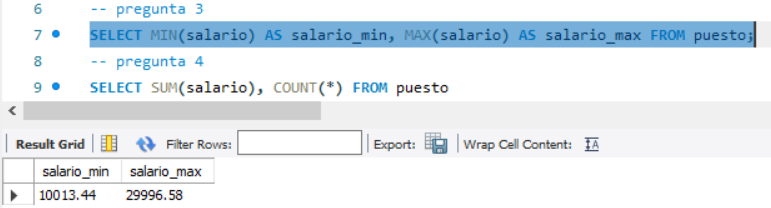
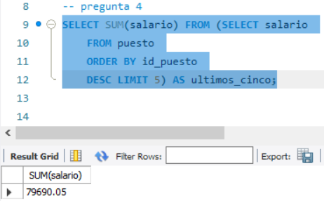

## Reto 2: Solución
- 1.-¿Cuál es el promedio de salario de los puestos?  
  
- 2.-¿Cuántos artículos incluyen la palabra Pasta en su nombre?  
  
- 3.-¿Cuál es el salario mínimo y máximo?  
  
- 4.- ¿Cuál es la suma del salario de los últimos cinco puestos agregados?  
  
