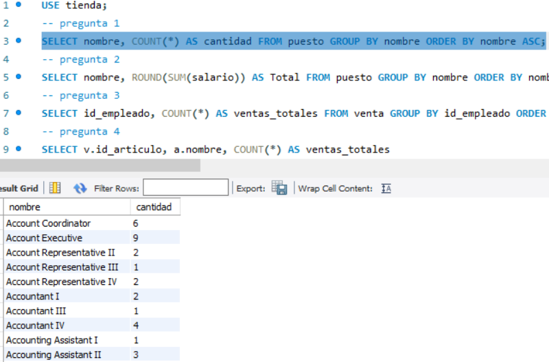
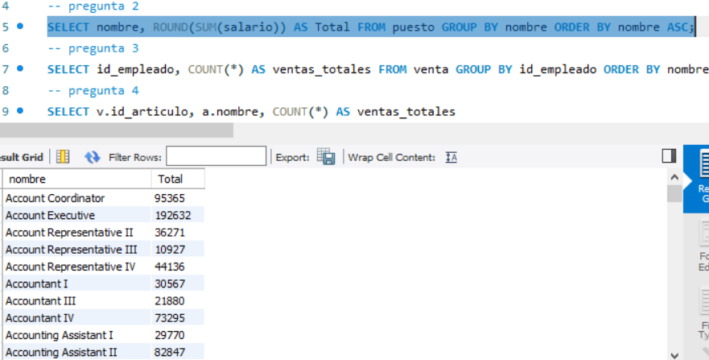
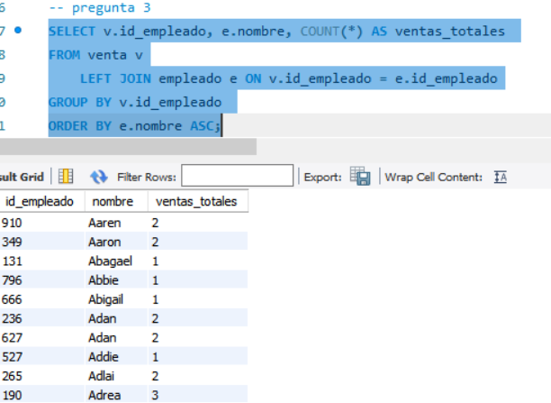
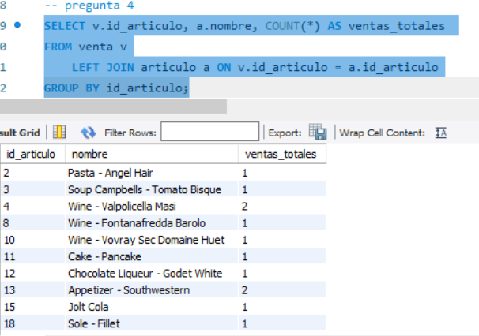

## Reto 3: Solución
- 1.-¿Cuántos registros hay por cada uno de los puestos?

- 2.-¿Cuánto dinero se paga en total por puesto?

- 3.-¿Cuál es el número total de ventas por vendedor?

- 4.-¿Cuál es el número total de ventas por artículo?
