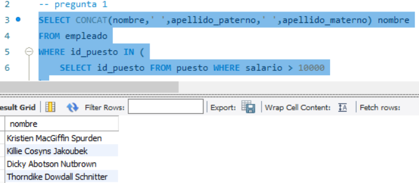
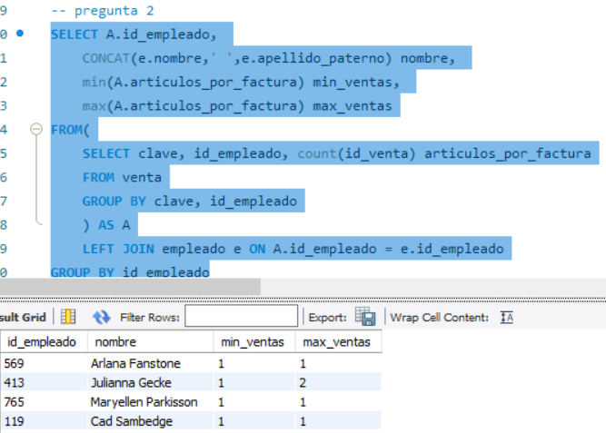
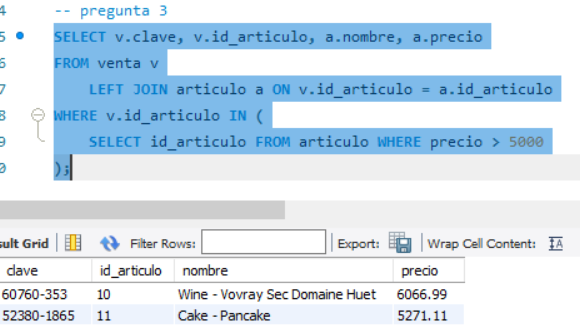

## Reto 1: Solución  
- 1.-¿Cuál es el nombre de los empleados cuyo sueldo es mayor a $100,000?  
  
- 2.-¿Cuál es la cantidad mínima y máxima de ventas de cada empleado?  
  
- 3.-¿Cuáles claves de venta incluyen artículos cuyos precios son mayores a $5,000?  
  