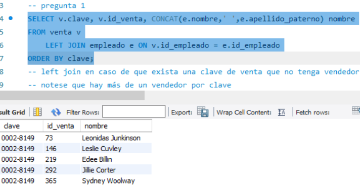
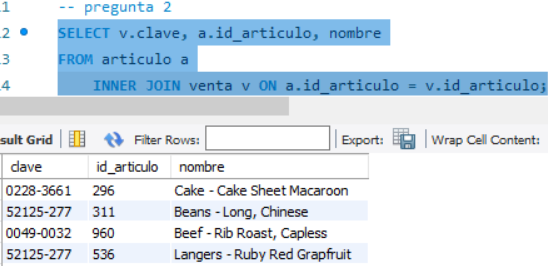
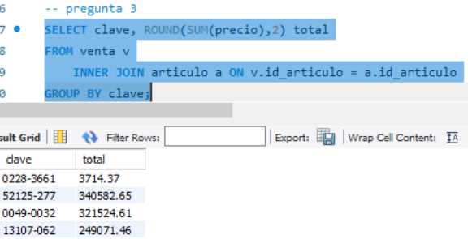

## Reto 2: Solución  
- 1.-¿Cuál es el nombre de los empleados que realizaron cada venta?  
  
- 2.-¿Cuál es el nombre de los artículos que se han vendido?  
  
- 3.-¿Cuál es el total de cada venta?  
  