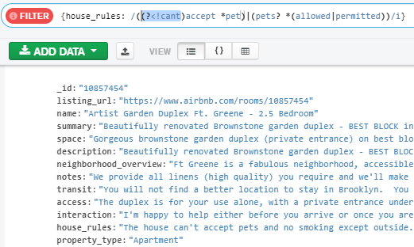

## Reto 1: Solución  
Los documentos JSON y los scripts python se encuentran en este mismo repositorio.
  
- 1.-Propiedades que no permitan fiestas. 
 
    \* Se usa espacio más counter ( * ó \s*) para poder igual atrapar strings donde por error se incluyeron más espacios.
    \*\* Notese que se usa el counter en not? pero no en parties?, ya que al estar al final del regex, no hace falta especificar el s. El regex atrapará parties o partie,  en caso de un error ortográfico.
  
- 2.-Propiedades que admitan mascotas.

    
- 3.- Propiedades que no permitan fumadores.
  
    \* Se usa la opción "er?" después de "smok" para atrapar smoke o smoker. Sin embargo, indicar "r?" no cambia la funcionalidad del regex, pues después de encontrar coincidencias con "smoke" no revisará qué caracter sigue.

- 4.- Propiedades que no permitan fiestas ni fumadores.

***
Si en la pregunta 2 queremos también incluir la opcción de "accept pets", pero sin estar precedido por algo como "can't", podemos usar un lookbehing (?<!) dentro del regex.  
Sin embargo, mongodb compass no soporta lookbehind. En la imagen se aprecia que el query  regresa un documento con "can't accept pets."
