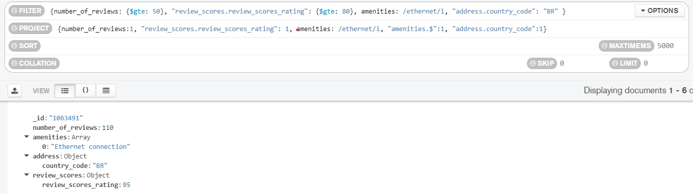

## Reto 2: Solución  
Los documentos JSON y los scripts python se encuentran en este mismo repositorio.
  
Usando la colección sample_airbnb.listingsAndReviews, agrega un filtro que permita obtener todas las publicaciones que tengan 50 o más comentarios, que la valoración sea mayor o igual a 80, que cuenten con conexión a Internet vía cable y estén ubicada en Brazil. 
 
    \* Se pueden usar coincidencias con arreglos directamente indicando un valor después de los dos puntos (como en amenities). MongoDB buscará que al menos uno de los elementos del array coincida con dicho valor.

