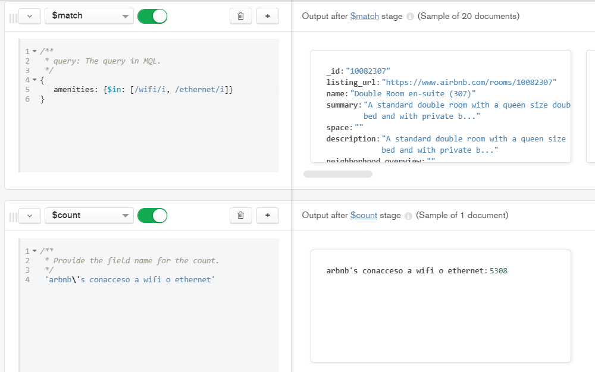

## Reto 3: Solución  
Los documentos JSON y los scripts python se encuentran en este mismo repositorio.
  
Usando la colección sample_airbnb.listingsAndReviews, mediante el uso de agregaciones, encontrar el número de publicaciones que tienen conexión a Internet, sea desde Wifi o desde cable (Ethernet).
 
    \* El acumulador count cuenta los documentos en la colección que recibe y regresa un único documento con el valor después de una string opcional.

