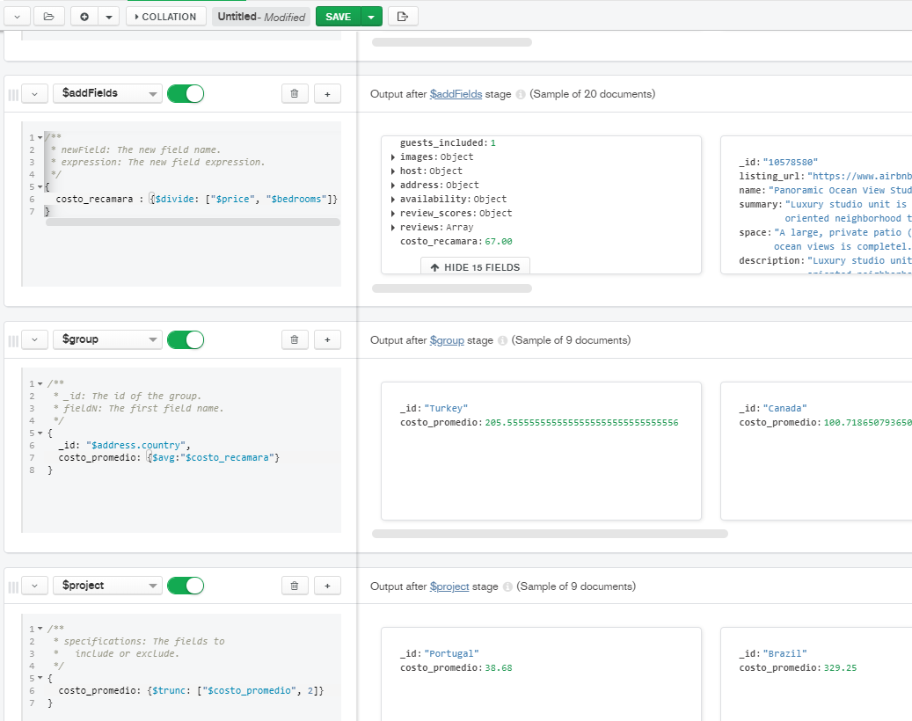

## Reto 1: Solución  
Los documentos JSON y los scripts python se encuentran en este mismo repositorio.
  
Con base en el ejemplo 1, modifica el agrupamiento para que muestre el costo promedio por habitación por país de las propiedades de tipo casa.
 

