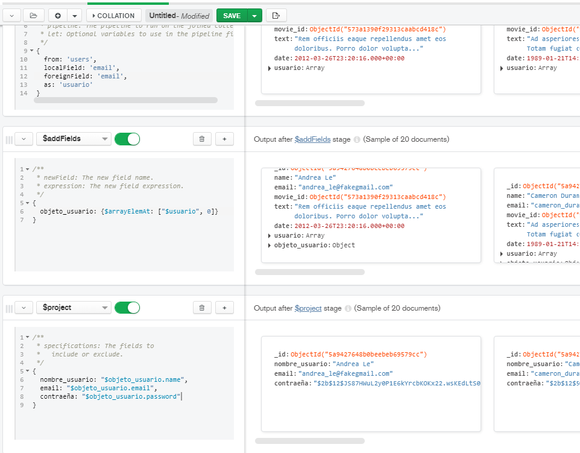

## Reto 2: Solución  
Los documentos JSON y los scripts python se encuentran en este mismo repositorio.
  
Usando las colecciones comments y users, se requiere conocer el correo y contraseña de cada persona que realizó un comentario. Construye un pipeline que genere como resultado estos datos.
 
\* Al igual que con el método $addFields, $project también puede crear nuvos campos, sólo indicándolos y asignandoles un valor.

