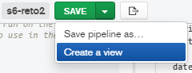

## Reto 3: Solución  

Desde MongoDB compass, basta con elegir la opción "create view" desde el botón "SAVE".
 
  
Con el uso de código, como en Mongo Shell, hacemos uso del método createView:
db.createView(  
    "usuarios_con_comentarios",  
    "comments"  
    [  
    [{$lookup: {  
        from: 'users',  
        localField: 'email',  
        foreignField: 'email',  
        as: 'usuario'  
    }},  
    {$addFields: {  
        objeto_usuario: {$arrayElemAt: ["$usuario", 0]}  
    }},  
    {$project: {  
        nombre_usuario: "$objeto_usuario.name",  
    email: "$objeto_usuario.email",  
    contraeña: "$objeto_usuario.password"  
    }}]  
    ]  
)  

